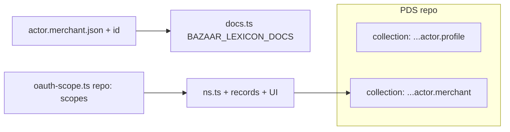

# Convert `actor.profile` lexicon to `actor.merchant`

## Impact summary

| Area                | Files                                                                                                                                                                                                                          | Notes                                                                                                                                                          |
| ------------------- | ------------------------------------------------------------------------------------------------------------------------------------------------------------------------------------------------------------------------------ | -------------------------------------------------------------------------------------------------------------------------------------------------------------- |
| Lexicon source      | `[packages/shared/src/lexicons/actor.profile.json](packages/shared/src/lexicons/actor.profile.json)`                                                                                                                           | Change `id` to `diamonds.whereditgo.bazaar.actor.merchant`; rename file to `actor.merchant.json` for consistency with siblings (`catalog.listing.json`, etc.). |
| Shared bundle       | `[packages/shared/src/lexicons/docs.ts](packages/shared/src/lexicons/docs.ts)`                                                                                                                                                 | Import/register the new JSON in `RAW_DOCS`.                                                                                                                    |
| OAuth               | `[packages/server/src/lib/atproto/oauth-scope.ts](packages/server/src/lib/atproto/oauth-scope.ts)`                                                                                                                             | Replace `col(ns, "actor.profile")` with `col(ns, "actor.merchant")` for create/update `repo:…` scopes (must stay in sync with client collection).              |
| Collection constant | `[packages/client/src/lib/atproto/ns.ts](packages/client/src/lib/atproto/ns.ts)`                                                                                                                                               | New NSID; rename key `actorProfile` → `actorMerchant` (or keep key and only change string—prefer rename for clarity).                                          |
| Types               | `[packages/client/src/types/lexicons.ts](packages/client/src/types/lexicons.ts)`                                                                                                                                               | `ActorProfile` → `ActorMerchant` with updated `$type` literal.                                                                                                 |
| Repo helpers        | `[packages/client/src/lib/atproto/records.ts](packages/client/src/lib/atproto/records.ts)`                                                                                                                                     | `createActorProfile` / `putActorProfile` → `createActorMerchant` / `putActorMerchant` (or keep names; renaming matches the lexicon).                           |
| UI                  | `[packages/client/src/routes/SettingsPage.tsx](packages/client/src/routes/SettingsPage.tsx)`, `[packages/client/src/components/public/PublicHeaderAccount.tsx](packages/client/src/components/public/PublicHeaderAccount.tsx)` | Imports, `BAZAAR_COLLECTION.*`, `listRecords` collection, inline `$type`, helper calls.                                                                        |

**Out of scope for code (optional later):** `[.alignment/](.alignment/)` markdown still mentions `actor.profile`; updating those is documentation-only and can lag.

**Cross-lexicon:** Grep shows no `$ref` to `actor.profile` from `[packages/shared/src/lexicons/*.json](packages/shared/src/lexicons)`; only the app registers and reads this collection.

## Execution plan

1. **Lexicon file** — Add `[packages/shared/src/lexicons/actor.merchant.json](packages/shared/src/lexicons/actor.merchant.json)` with the same `defs` as today but `"id": "diamonds.whereditgo.bazaar.actor.merchant"`. Delete `[actor.profile.json](packages/shared/src/lexicons/actor.profile.json)`.
2. **Wire shared package** — Update `[docs.ts](packages/shared/src/lexicons/docs.ts)`: import `actor.merchant.json`, export it in `RAW_DOCS` (replace `actorProfile` variable name with `actorMerchant` or similar).
3. **Server OAuth** — In `[oauth-scope.ts](packages/server/src/lib/atproto/oauth-scope.ts)`, use `"actor.merchant"` in `bazaarRepoOAuthScopes()` (comment already says keep in sync with client).
4. **Client constants and types** — `[ns.ts](packages/client/src/lib/atproto/ns.ts)` + `[lexicons.ts](packages/client/src/types/lexicons.ts)`: new NSID and renamed exported type.
5. **Record API** — `[records.ts](packages/client/src/lib/atproto/records.ts)`: point helpers at `BAZAAR_COLLECTION.actorMerchant` and new `$type`; rename exported functions for consistency.
6. **Call sites** — `[SettingsPage.tsx](packages/client/src/routes/SettingsPage.tsx)` and `[PublicHeaderAccount.tsx](packages/client/src/components/public/PublicHeaderAccount.tsx)`: update imports, collection, `$type`, and helper names.
7. **Verify** — Run workspace typecheck/tests (`npm run build` or package scripts you use). Sign in again locally so OAuth includes the new `repo:…actor.merchant` scopes (old tokens would not authorize the new collection).

## Local / dev notes (you asked to ignore production lexicon risk)

- Any existing `at://…/diamonds.whereditgo.bazaar.actor.profile/self` records will **not** be read after the cutover; treat as a fresh collection or manually migrate/copy if you care about old sandbox repos.
- Re-authentication after scope change is expected for OAuth.
