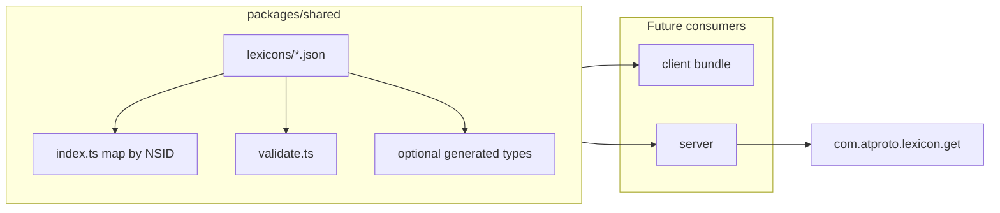

# Lexicon implementation in the monorepo stack

**Canonical proposal:** [LEXICON_DRAFT_V5.md](./LEXICON_DRAFT_V5.md) (April 2026). This plan describes how that lexicon set lands in the Turbo monorepo; it does not spell out deep client or server product logic.

## Checklist

- [ ] Create `packages/shared` with package.json, tsconfig, exports for lexicons
- [ ] Add `lexicons/*.json` from **LEXICON_DRAFT_V5.md** (one file per NSID + `defs.json`; see file list below — extends [NOTE_ON_LEXICON_PLACEMENT.md](./NOTE_ON_LEXICON_PLACEMENT.md))
- [ ] Implement `index.ts` (NSID map) and `validate.ts` (SDK/CLI wrapper)
- [ ] Wire workspace deps and a validate/lint script (optional CI)
- [ ] Add Hono `com.atproto.lexicon.get` using shared lexicons map
- [ ] Optional: lexicon codegen → `packages/shared` generated types (JSON remains canonical)
- [ ] Replace client scaffold (`lexicons.ts`, `ns.ts`, hand-rolled types) with shared imports and **v5** shapes/NSIDs (follow-up)

## What the alignment docs specify

- **[NOTE_ON_LEXICON_PLACEMENT.md](./NOTE_ON_LEXICON_PLACEMENT.md)** — Layout: `packages/shared/src/lexicons/` with one JSON file per lexicon (trailing NSID segment), plus `index.ts` and `validate.ts`. Single import surface (e.g. `lexicons[nsid]`). Hono exposes `GET /xrpc/com.atproto.lexicon.get?lexicon=<nsid>`. Prefer lexicon codegen for TypeScript types, not hand-written types as source of truth.

- **[LEXICON_DRAFT_V5.md](./LEXICON_DRAFT_V5.md)** — Namespace `diamonds.whereditgo.bazaar.*`; authority host `bazaar.whereditgo.diamonds`. **v5** deltas to carry into implementation (summary only):
  - **`catalog.listing`** — required `licenseUri` and `licenseGrantCid`; listing is the authoritative commercial offer for license terms (item/collection `defaultLicenseUri` is form default only).
  - **`purchase.receipt`** — required `buyerDid`; verification step 2 uses `SHA-256(purchasedAt:paymentRef:itemUri:listingCid:buyerDid)` for `appSig`.
  - **`purchase.consent`** — **new** record on buyer’s PDS at checkout; names buyer and `licenseGrantCid`; optional `syncProject` for sync tiers; required for commercial/sync per proposal, recommended for personal.
  - **`license.terms#usageRestrictions`** — `requiresShareAlike` boolean for CC SA-style terms.
  - **`defs#bazaarIdentifier`** — self-issued signed identifiers (`bazaarRid` / `bazaarWid` / `bazaarPid` patterns); see identifier placement table in v5.
  - **`catalog.composition`** — **new** record (alongside `catalog.recording` and other catalog records).
  - **`catalog.item.digital`** — v4+ shape uses `fileChecksum`, `fileCid`, `fileFormat` (not v3 `audio*` names); optional `bazaarRid`; mutability rules in v5.
  - **Directives** — licensing UI must be a three-state panel; license is per-listing with explicit confirmation at listing creation (product work; see v5 “Action items” and [26_4_3-license-templates.md](./26_4_3-license-templates.md) if you track templates there).

Full record/authorship, verification flow (including consent and `bazaar*` signature checks), known gaps, and out-of-scope items are defined in v5 and should be read there.

## Lexicon JSON files (v5)

Use the fenced JSON in **LEXICON_DRAFT_V5.md** verbatim. Filenames follow trailing NSID segment (per note); **extend** the note’s list with v5 additions:

| File |
|------|
| `defs.json` |
| `catalog.item.digital.json` |
| `catalog.item.physical.json` |
| `catalog.item.bundle.json` |
| `catalog.collection.json` |
| `catalog.listing.json` |
| `catalog.recording.json` |
| `catalog.composition.json` |
| `license.terms.json` |
| `purchase.receipt.json` |
| `purchase.consent.json` |
| `purchase.stock.json` |
| `purchase.fulfillment.json` |
| `actor.profile.json` |

## Current repo state (relevant gap)

- There is **no** [`packages/shared`](../../packages/shared) package yet; workspaces are only `packages/*` ([`package.json`](../../package.json)).
- A **scaffold** exists in [`packages/client/src/lib/atproto/lexicons.ts`](../../packages/client/src/lib/atproto/lexicons.ts) and [`packages/client/src/types/lexicons.ts`](../../packages/client/src/types/lexicons.ts). It predates v5: wrong collection NSID (`…bazaar.collection` vs `…catalog.collection`), older listing/collection shapes, no `purchase.consent`, no `catalog.composition`, no listing `licenseUri` / `licenseGrantCid`, digital item fields and defs do not match v5. Treat **v5 markdown JSON** as canonical and remove duplication once shared files exist.

## Target architecture (stack only)

## Implementation steps (ordered)

1. **Add `packages/shared`**
   - New workspace package (`package.json`, `tsconfig.json`) with explicit `name` and `exports` for the lexicon entrypoint.
   - Depend on `@bazaar/shared` (or chosen name) from `packages/client` and `packages/server` when wiring imports. Turbo [`turbo.json`](../../turbo.json) already uses `dependsOn: ["^build"]` for `build`, so shared should build before dependents once it has a `build` script.

2. **Materialize canonical lexicon JSON**
   - Create `packages/shared/src/lexicons/` with the **v5 file list** above.
   - Copy from **LEXICON_DRAFT_V5.md** verbatim (preserves `id`, `$ref` chains including `defs#bazaarIdentifier`, record keys such as `literal:self` on `actor.profile`).
   - **Quality gate:** npm/CI script that validates all docs and cross-lexicon `$ref` resolution.

3. **`index.ts`: NSID-keyed catalog**
   - Import each JSON (`resolveJsonModule` / bundler support) and export `lexicons: Record<string, LexiconDoc>` keyed by each document’s `id`, for `com.atproto.lexicon.get` and internal validators.

4. **`validate.ts`**
   - Thin wrapper over ATProto lexicon validation (`@atproto/api` or CLI), e.g. `validateRecord(nsid, value)` using the full map for external refs. When to validate in app flows remains a separate concern.

5. **Optional: codegen**
   - Point official lexicon codegen at `packages/shared/src/lexicons`; emit to e.g. `packages/shared/src/generated/`. Regenerate when lexicons change.

6. **`com.atproto.lexicon.get`**
   - Hono route (e.g. `packages/server/src/routes/lexicon.ts`): query `lexicon`, return JSON or 404 (`LexiconNotFound`). Mount from existing server entry. Matches v5 § “Lexicon serving” when served at `bazaar.whereditgo.diamonds`.

7. **Deprecation path for the client scaffold**
   - After shared JSON exists, delete or thin-wrap `packages/client/src/lib/atproto/lexicons.ts`; align `ns.ts`, `records.ts`, and types with **v5** NSIDs and fields (`catalog.collection`, `fileCid`, listing `licenseUri` / `licenseGrantCid`, receipt `buyerDid`, etc.).

## Out of scope (stack plan only)

- Upload forms, listing wizard, license picker UX, checkout consent UI (see v5 directives and action items).
- Receipt/signing implementation, Stripe, download entitlement, PDS write permissions.

## Risk / consistency notes

- **Cutover:** Any data written under older NSIDs or pre-v5 shapes must be migrated or treated as incompatible; v5 is not a drop-in for the current client scaffold.
- **`$ref` resolution:** Validators and codegen need the **full** lexicon set (especially `defs.json` and any cross-doc refs).
- **Placement note drift:** [NOTE_ON_LEXICON_PLACEMENT.md](./NOTE_ON_LEXICON_PLACEMENT.md) omits `catalog.composition.json` and `purchase.consent.json`; this plan and v5 supersede that list until the note is updated.
