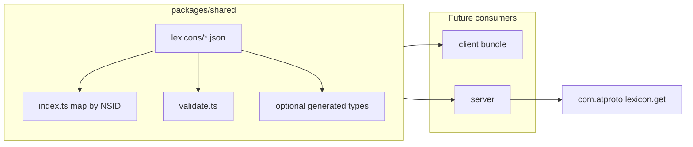

# Lexicon implementation in the monorepo stack

**Source:** Cursor plan *Lexicon stack implementation* (saved here for alignment tracking).

## Checklist

- [ ] Create `packages/shared` with package.json, tsconfig, exports for lexicons
- [ ] Add `lexicons/*.json` from LEXICON_DRAFT_V3.md (one file per NSID + defs.json)
- [ ] Implement index.ts (NSID map) and validate.ts (SDK/CLI wrapper)
- [ ] Wire workspace deps and a validate/lint script (optional CI)
- [ ] Add Hono `com.atproto.lexicon.get` using shared lexicons map
- [ ] Optional: lexicon codegen script → packages/shared generated types
- [ ] Replace client lexicons.ts/ns.ts with shared + v3 NSIDs (follow-up)

## What the alignment docs specify

- **[NOTE_ON_LEXICON_PLACEMENT.md](./NOTE_ON_LEXICON_PLACEMENT.md)** — Canonical lexicons live under `packages/shared/src/lexicons/`: one JSON file per lexicon (filename = trailing NSID segment), plus `defs.json`. `index.ts` re-exports a map keyed by full NSID; `validate.ts` wraps the ATProto SDK lexicon validator. The authority host for public resolution is `bazaar.whereditgo.diamonds` via `GET /xrpc/com.atproto.lexicon.get?lexicon=<nsid>`. Types, if desired, are **generated** from JSON (e.g. lexicon codegen) into something like `packages/shared/src/types/`, not hand-written as primary truth.

- **[LEXICON_DRAFT_V3.md](./LEXICON_DRAFT_V3.md)** — Namespace `diamonds.whereditgo.bazaar.*`; record set: `defs` (object defs only), `catalog.item.digital`, `catalog.item.physical`, `catalog.item.bundle`, `catalog.collection`, `catalog.listing`, `catalog.recording`, `license.terms`, `purchase.receipt`, `purchase.stock`, `purchase.fulfillment`, `actor.profile`. v3 changes: `itemRef#itemType` includes `catalog.collection`; `catalog.item.digital` gains optional `collectionUri`; `catalog.collection` replaces `tracks` with generalized `items` (role, essential, optional title / trackNumber / discNumber). Document also defines authorship matrix, verification narrative, and known gaps—relevant for **future** validation policy, not for the mechanical “lexicons in repo” work.

## Current repo state (relevant gap)

- There is **no** [`packages/shared`](../../packages/shared) package yet; workspaces are only `packages/*` ([`package.json`](../../package.json)).
- A **scaffold** exists in [`packages/client/src/lib/atproto/lexicons.ts`](../../packages/client/src/lib/atproto/lexicons.ts) and hand-rolled types in [`packages/client/src/types/lexicons.ts`](../../packages/client/src/types/lexicons.ts). That scaffold **does not match v3** (e.g. `diamonds.whereditgo.bazaar.collection` vs `diamonds.whereditgo.bazaar.catalog.collection`, older collection shape, thinner `defs` than the proposal). Implementation should treat the markdown JSON blocks in v3 as canonical and retire duplication in favor of shared files.

## Target architecture (stack only)

## Implementation steps (ordered)

1. **Add `packages/shared`**
   - New workspace package (`package.json`, `tsconfig.json`) exporting subpaths or a single entry for lexicons (e.g. `@bazaar/shared/lexicons` as in the note—exact package name should match your existing naming; today there is no `@bazaar/shared`, so define `name` and `exports` explicitly).
   - Add `@bazaar/shared` (or chosen name) as a dependency of `packages/client` and `packages/server` when you wire imports; **Turbo**: ensure `build` depends on `^build` so shared builds first ([`turbo.json`](../../turbo.json) already has `dependsOn: ["^build"]` for `build`).

2. **Materialize canonical lexicon JSON**
   - Create `packages/shared/src/lexicons/` with the file set from the note: `defs.json`, `catalog.item.digital.json`, `catalog.item.physical.json`, `catalog.item.bundle.json`, `catalog.collection.json`, `catalog.listing.json`, `catalog.recording.json`, `license.terms.json`, `purchase.receipt.json`, `purchase.stock.json`, `purchase.fulfillment.json`, `actor.profile.json`.
   - Copy structure from the fenced JSON in **LEXICON_DRAFT_V3.md** verbatim (preserves `id`, `$ref` targets like `diamonds.whereditgo.bazaar.defs#money`, and record `key` values such as `literal:self` for `actor.profile`).
   - **Quality gate:** run lexicon validation in CI or a npm script (see step 4) so invalid `$ref` or lexicon 1 schema errors fail fast.

3. **`index.ts`: NSID-keyed catalog**
   - Import each JSON (with `resolveJsonModule` / appropriate bundler settings) and export a single object `lexicons: Record<string, LexiconDoc>` keyed by each document’s `id` field, matching the note’s `lexicons[id]` lookup for `com.atproto.lexicon.get`.
   - Optionally export a const tuple of all Bazaar NSIDs for exhaustive checks elsewhere.

4. **`validate.ts`**
   - Thin wrapper around the ATProto ecosystem’s lexicon validation (the note references “your ATProto SDK’s lexicon validator”). Concretely: depend on the same stack you already use (`@atproto/api` is present on client/server); locate the supported API for validating a record or value against a loaded lexicon doc (or use official lexicon CLI validation in a script if runtime validation is unnecessary).
   - Expose a small surface, e.g. `validateRecord(nsid, value)` that loads the right doc from the map and returns success/errors—**policy** (when to validate) stays out of scope per the original planning brief.

5. **Optional: codegen**
   - Add a dev-only script using ATProto lexicon codegen pointed at `packages/shared/src/lexicons`, emitting into e.g. `packages/shared/src/generated/` or `packages/shared/src/types/`. Document in package README or script comment that **JSON is canonical**; regenerate on lexicon changes. Skip initially if you prefer to migrate types manually once.

6. **`com.atproto.lexicon.get` (server hook, not deep integration)**
   - Add a route module (e.g. `packages/server/src/routes/lexicon.ts`) that reads `lexicon` query param, returns `lexicons[id]` JSON or 404 with a stable error shape (`LexiconNotFound` as sketched in the note). Mount it on the existing Hono app (`packages/server/src/index.ts` / `api.ts`).
   - **Deployment alignment:** when the public hostname matches `bazaar.whereditgo.diamonds`, this route satisfies the resolution contract in v3 § “Lexicon serving”; until then, same path can serve staging.

7. **Deprecation path for the scaffold (later pass)**
   - Remove or re-export from `packages/client/src/lib/atproto/lexicons.ts` so the only canonical definitions are under `packages/shared`. Update `packages/client/src/lib/atproto/ns.ts` and any `$type` strings to **v3 NSIDs** (`catalog.collection`, not `collection`).
   - This step is explicitly **after** shared JSON exists so you do not maintain two truths.

## Out of scope (original planning brief)

- How the client builds forms, puts records, or lists collections against these lexicons.
- How the server enforces receipts, fulfillment, or entitlement using resolved records.
- PDS `putRecord` permission models, Stripe, or download delivery.

## Risk / consistency notes to carry forward

- **Breaking NSID and schema changes** between the current client scaffold and v3 must be treated as a single cutover for any live data (proposal states no production records yet).
- **`$ref` resolution:** validator and any codegen must resolve inter-lexicon refs (`defs#…`) from the full set of docs in the map, not a single file in isolation.
