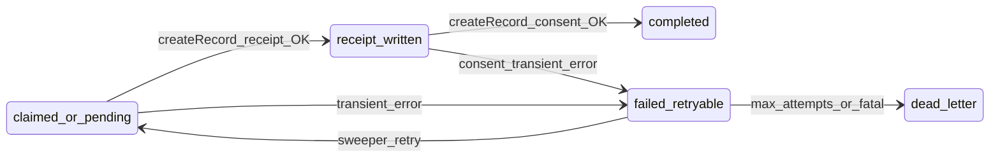

# PaymentIntent-backed PDS fulfillment (migration + retries)

## Current behavior (gaps)

The webhook in `[packages/server/src/routes/stripe.ts](packages/server/src/routes/stripe.ts)` already:

- Keys idempotency off `meta.key = purchase_pds:${paymentRef}` and early-returns if JSON contains `receiptUri`.
- Writes `purchase_pds:*` and `receipt:*` only **after** both PDS `createRecord` calls succeed.

Problems for “at most one record / reconciled per transaction”:

1. **No durable in-progress state** — If receipt is created on the PDS but consent fails (or the process crashes before updating `meta`), the next webhook delivery **does not** see `receiptUri` in `purchase_pds` and can **create a second receipt** (duplicate `createRecord`).
2. **Concurrent webhooks** — Two overlapping handlers can both pass the initial `purchase_pds` read before either commits.
3. **No internal retries** — The handler almost always returns `200` / `{ received: true }`, so **Stripe does not retry**; transient PDS/OAuth errors never get a backoff retry unless you add your own loop or poller.

## Target design

- **Primary key:** Stripe PaymentIntent id (`pi_…`) — already the stable `paymentRef` used in records and metadata.
- **Claim + update in SQLite** using a **transaction with `BEGIN IMMEDIATE`** (via Bun’s sqlite / drizzle transaction) so only one concurrent worker “owns” a row for a given PI at a time.
- **Resume:** Columns store `receiptUri`, `receiptCid`, `consentUri` when each step succeeds. On any retry (webhook or sweeper), **skip** `createRecord` for receipt if `receiptUri` is non-null; **skip** consent if `consentUri` is non-null.
- **At-most-one receipt (practical):** Guaranteed under normal operation by “never call receipt `createRecord` if DB already has `receiptUri`”. The remaining edge case is a crash **after** PDS accepts the write **before** the DB row is updated; mitigations (optional follow-up): deterministic `rkey` / `putRecord` if the lexicon allows, or a reconciliation pass that lists buyer repo records by `paymentRef`. The plan should implement the DB-resume path first; document the narrow crash window.

## Drizzle migration

1. Extend `[packages/server/src/db/schema.ts](packages/server/src/db/schema.ts)` with a new table, e.g. `payment_fulfillment`:
   Suggested columns (all snake_case in SQL, camelCase in Drizzle as you prefer):

- `payment_intent_id` `text` **PRIMARY KEY**
- `checkout_session_id` `text` (nullable; from `session.id` for support/debug)
- `status` `text` **NOT NULL** — enum-like: `pending` | `processing` | `receipt_written` | `completed` | `failed` | `dead_letter`
- `attempt_count` `integer` **NOT NULL** default `0`
- `next_retry_at` `integer` (unix ms; nullable — set on transient failure with exponential backoff)
- `last_error` `text` (nullable, truncated length cap in app code)
- `receipt_uri` / `receipt_cid` / `consent_uri` `text` (nullable)
- `payload_snapshot` `text` (nullable JSON blob: minimal fields needed to rebuild `receiptRecord` / consent inputs if you want sweeper to run without re-fetching Stripe — optional; can also re-validate from Stripe + listing each time)
- `created_at` / `updated_at` `integer` (timestamps)

1. Add `[packages/server/drizzle/0001_payment_fulfillment.sql](packages/server/drizzle/0001_payment_fulfillment.sql)` with `CREATE TABLE` matching the schema (same style as `[0000_init.sql](packages/server/drizzle/0000_init.sql)`).
2. Run `npm run db:generate` only if you prefer kit-generated SQL; otherwise hand-author `0001` to match team workflow (repo already has hand-written `0000`).
3. Optional **data backfill** script or one-time migration step: copy rows from `meta` where `key LIKE 'purchase_pds:%'` into `payment_fulfillment` with `status = completed` so history is unified (nice-to-have).

## Code changes

1. **Extract fulfillment logic** from the webhook into a dedicated module, e.g. `[packages/server/src/lib/stripe/fulfillPaymentIntent.ts](packages/server/src/lib/stripe/fulfillPaymentIntent.ts)` (or under `routes/stripe/` as a helper), callable with `(db, stripe, oauthClient, { session, eventId? })`.
2. **Transactional claim** (pseudocode):

- `db.transaction((tx) => { ... }, { behavior: 'immediate' })` if supported by drizzle+bun-sqlite; if not, use raw `sqlite.run('BEGIN IMMEDIATE')` inside the transaction callback per Bun docs.
- `SELECT` fulfillment row for `payment_intent_id`.
- If `status === 'completed'` → return no-op.
- If another row is `processing` and `updated_at` is **very recent** (e.g. < 2 min), optionally **skip** (assume other worker) or use stale lock steal after TTL — document choice; simplest is **staleness-based re-claim** after N minutes.
- Else `INSERT` or `UPDATE` to set `status = 'processing'`, bump `attempt_count`, clear `next_retry_at`, set `updated_at`.

1. **Reuse existing validation** (PI retrieve, amount/currency, listing CID, buyerDid, signing, OAuth restore) from the current webhook body — only the **persistence boundaries** change: after successful receipt `createRecord`, **update row** with `receipt_uri`, `receipt_cid`, `status = 'receipt_written'` **before** attempting consent. After consent, set `consent_uri`, `status = 'completed'`.
2. **Errors:**

- **Retryable** (network, 5xx-ish PDS, rate limits): set `status = 'failed'`, `next_retry_at = now + backoff`, `last_error`.
- **Non-retryable** (invalid metadata, amount mismatch, buyerDid missing): `status = 'dead_letter'`, `last_error`, still return `200` to Stripe to avoid infinite replays (same as today for validation failures).

1. **Retry sweeper:** Start a lightweight interval from `[packages/server/src/index.ts](packages/server/src/index.ts)` (or `api.ts` bootstrap) when `NODE_ENV`/env flag allows, e.g. every 30–60s:

- `SELECT * FROM payment_fulfillment WHERE status IN ('failed','pending') AND (next_retry_at IS NULL OR next_retry_at <= ?) AND attempt_count < ? ORDER BY next_retry_at LIMIT N`
- For each row, call the same `fulfillPaymentIntent` entry point (reuse Stripe session id from column or re-resolve from PI metadata if you store `checkout_session_id`).

1. **Keep or slim `meta`:**

- Either **dual-write** `receipt:${paymentRef}` for debugging as today, or migrate debug output to columns / `last_error` only.
- Deprecate `purchase_pds:` in favor of the new table’s `completed` row (optional migration to delete old keys after backfill).

1. **Stripe webhook dedup (optional but cheap):** Store `stripe_event_id` on the row or a tiny `webhook_events` table with `event_id PRIMARY KEY` to ignore duplicate `checkout.session.completed` deliveries before heavy work. Not strictly required if PI claim is correct, but reduces redundant Stripe validation.

## Acceptance criteria

- Under parallel webhook deliveries for the same PI, **at most one** receipt `createRecord` and **at most one** consent `createRecord` for that PI (verified by DB state + manual Stripe test).
- After injecting a transient PDS failure (or temporary invalid token), the sweeper **eventually** reaches `completed` without manual DB edits.
- `npm run db:migrate` applies `0001` cleanly on an existing DB with only `meta`.

## Out of scope (follow-ups)

- Cross-checking PDS vs DB in a separate **reconciliation** admin job.
- Deterministic `rkey` / `putRecord` for cryptographic at-most-once on the PDS itself (depends on lexicon + `com.atproto.repo.putRecord` rules).
