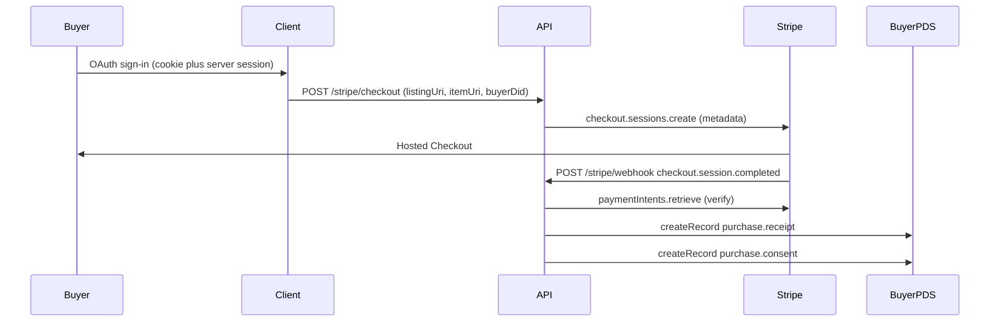

# Bazaar — Add payment flow (receipt + consent on buyer PDS)

**Date:** 4 April 2026  
**Status:** Plan — not yet implemented  
**Target executor:** AI agent  
**Depends on lexicon:** [../260403-lexicon-support/LEXICON_DRAFT_V5.md](../260403-lexicon-support/LEXICON_DRAFT_V5.md) (`purchase.receipt`, `purchase.consent`, listing `licenseUri` / `licenseGrantCid`)

---

## Goal

Minimum viable **server-side purchase flow**: Stripe webhook → verify PaymentIntent → write `diamonds.whereditgo.bazaar.purchase.receipt` to the buyer’s PDS → write `diamonds.whereditgo.bazaar.purchase.consent` alongside it. This pair is the core trust artifact; UI, delivery, and entitlement checks stay downstream.

Client: gate checkout on buyer ATProto sign-in and pass `buyerDid` into checkout metadata. Item detail + `BuyButton` can serve as the payment entry point (no separate checkout page required for MVP).

---

## Context

- **Lexicon JSON** lives in `packages/shared/src/lexicons/` and matches v5. Collection NSIDs align with `packages/client/src/lib/atproto/ns.ts` (`receipt`, `consent`).
- **`packages/server/src/routes/stripe.ts`** already creates Checkout Sessions with metadata (`listingUri`, `itemUri`, `listingCid`, `appDid`, `buyerDid`), verifies webhook signatures, handles `checkout.session.completed`, signs `appSig` when `buyerDid` is present, and persists a payload to SQLite `meta`. It does **not** call `com.atproto.repo.createRecord`.
- **`packages/server/src/api.ts`** does not pass `oauthClient` into `createStripeRouter` today.
- **OAuth sessions** are stored server-side keyed by DID (`oauth:session:${sub}` in `packages/server/src/lib/atproto/oauth.ts`). The webhook can call `oauthClient.restore(buyerDid)` and `new Agent(session)` to `createRecord` on `repo: buyerDid` **without** the browser cookie, **if** the buyer completed real OAuth through Bazaar.
- **Dev mock sign-in** (`VITE_DEV_MOCK_ATPROTO_SIGNIN` + `localStorage` in `packages/client/src/hooks/useAtpSession.ts`) does **not** create a server session — PDS writes from the webhook will fail for mock buyers until they use real OAuth.

---

## 1. Server — inject OAuth client and PDS writes

### 1.1 `packages/server/src/api.ts`

- Pass `oauthClient` into `createStripeRouter(db, oauthClient)` (same pattern as `createAtprotoRouter`).

### 1.2 `packages/server/src/routes/stripe.ts`

**`POST /checkout`**

- When Stripe is configured (non-mock), **require `buyerDid`** in the JSON body; return **400** if missing (webhook cannot sign receipt or choose repo without it).
- Optionally validate DID shape.
- Keep embedding **`listingCid`** from `getRecord` at session creation (listing snapshot anchor).

**`POST /webhook`** (after signature verification, event `checkout.session.completed`):

1. **PaymentIntent** — Resolve `session.payment_intent`, call `stripe.paymentIntents.retrieve(id)`, assert `status === "succeeded"`. Use the PaymentIntent id as **`paymentRef`** (lexicon).
2. **Amount / currency** — Compare PI `amount_received` and `currency` to `listing.price` on the listing record (same smallest-unit semantics as Checkout `unit_amount`). On mismatch: log and **skip** PDS writes; still respond **200** to Stripe to avoid retry storms (or document a deliberate 500 policy if you prefer retries).
3. **Listing snapshot** — `getRecord` for the listing with **`cid`** equal to `metadata.listingCid` when supported, so the record matches checkout. If that fails, treat as stale checkout and skip PDS writes.
4. **Build `purchase.receipt`** (v5 required fields):
   - `item` from `listing.item` (`uri`, `itemType`; include `cid` if available).
   - `listingUri`, `listingCid` from metadata.
   - `pricePaid` from PI / session.
   - `paymentProcessor`: e.g. `"stripe"`.
   - `paymentRef`: PaymentIntent id.
   - `licenseGrantUri`, `licenseGrantCid` from listing (`licenseUri`, `licenseGrantCid`).
   - `buyerDid`, `appDid` (`process.env.APP_DID`), `issuerScope` (artist DID from resolved item or env, per current logic).
   - `purchasedAt`: single ISO timestamp shared with consent.
   - `appSig`: `signReceiptPayload` in `packages/server/src/lib/atproto/sign.ts`.
5. **Idempotency** — Before writes, check `meta` (e.g. `receipt_pds:${paymentRef}` or extend existing `receipt:${paymentRef}`). If already written, return early.
6. **Receipt write** — `oauthClient.restore(buyerDid)` → `Agent` → `com.atproto.repo.createRecord` on buyer repo, collection `diamonds.whereditgo.bazaar.purchase.receipt`. Store returned `uri` and `cid`.
7. **Consent** — Add `signConsentPayload` / `verifyConsentPayload` with preimage `buyerDid:licenseGrantCid:receiptCid:consentedAt` (same RSA-SHA256 style as receipt). Build `purchase.consent`; set `consentedAt` to the same instant as `purchasedAt` for MVP. Optional `usageTier` / `syncProject` later via checkout metadata. Second `createRecord` for `diamonds.whereditgo.bazaar.purchase.consent`.
8. **Persist** merged outcome in `meta` (URIs, CIDs, error notes).

**Errors** — If `restore(buyerDid)` fails, log, persist failure in `meta`, return 200 to Stripe; do not throw unhandled.

### 1.3 `packages/server/src/lib/atproto/sign.ts`

- Implement **`signConsentPayload`** and **`verifyConsentPayload`**.
- Add tests in `packages/server/src/lib/atproto/sign.test.ts`.

---

## 2. Client — accept payment (minimal)

### 2.1 `packages/client/src/components/public/BuyButton.tsx`

- Use **`useAtpSession()`**: if no session, show **Sign in to purchase** with `returnTo` back to the current item URL (same-origin path rules as existing OAuth helpers).
- Include **`buyerDid: session.did`** in `POST /api/stripe/checkout`.
- Preserve clickwrap: require agreement when `licenseTerms.checkoutConsentRequired !== false` before enabling buy.

### 2.2 `packages/client/src/routes/PurchaseSuccessPage.tsx`

- Update copy: receipt and consent are written by the **webhook** when Stripe and a **server-side** OAuth session for the buyer exist. Point users to library/dashboard if applicable.

---

## 3. Preconditions and operations

- **Env:** `STRIPE_SECRET_KEY`, `STRIPE_WEBHOOK_SECRET`, `APP_DID`, `APP_SERVICE_PRIVATE_KEY` (valid PEM), `ATPROTO_SERVICE` reachable from the server.
- **Buyer PDS** must allow creating `diamonds.whereditgo.bazaar.*` records (lexicon registration on that repo).
- **Local webhooks:** `stripe listen --forward-to localhost:3000/api/stripe/webhook` with a buyer who completed real OAuth through the app.

---

## 4. Explicitly out of scope (this iteration)

- Upload form / licensing panel work beyond what `ItemDetailPage` already loads.
- Download URLs and entitlement enforcement.
- Stripe Connect / merchant `account-status` (stubs remain).

---

## Implementation checklist

- [ ] Pass `oauthClient` into `createStripeRouter` from `packages/server/src/api.ts`.
- [ ] Add `signConsentPayload` / `verifyConsentPayload` + tests in `packages/server/src/lib/atproto/sign.ts`.
- [ ] Require `buyerDid` on `POST /stripe/checkout` when Stripe is enabled.
- [ ] Webhook: verify PaymentIntent, validate price vs listing, listing CID snapshot, idempotent `createRecord` receipt then consent via `oauthClient.restore(buyerDid)`.
- [ ] `BuyButton`: session gate, pass `buyerDid`, sign-in `returnTo`.
- [ ] `PurchaseSuccessPage`: accurate messaging.
