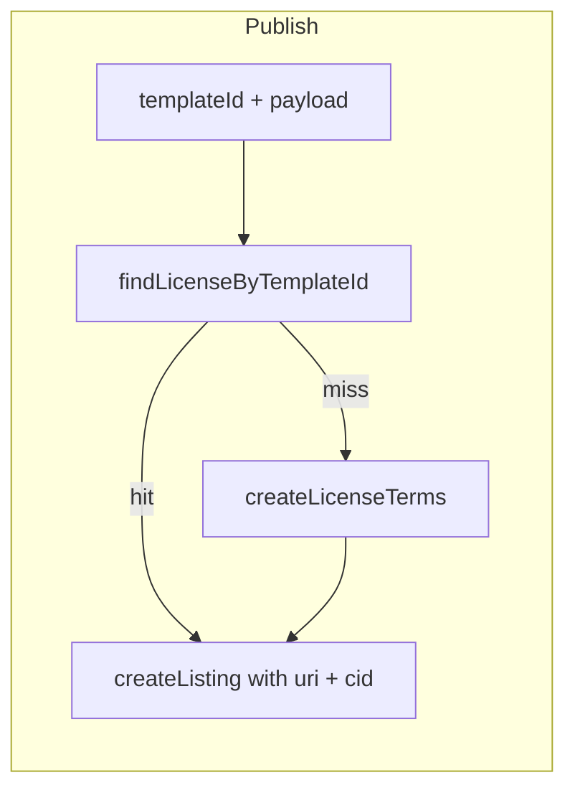

# Complete licensing page flow and listing anchor

## Lexicon and payment contract (already aligned)

- `[packages/shared/src/lexicons/license.terms.json](packages/shared/src/lexicons/license.terms.json)` defines the merchant-authored `diamonds.whereditgo.bazaar.license.terms` record (required: `title`, `tier`, `rightsType`, `version`, `territoryCoverage`, `checkoutConsentRequired`, `createdAt`).
- `[packages/shared/src/lexicons/catalog.listing.json](packages/shared/src/lexicons/catalog.listing.json)` requires `licenseUri` and `licenseGrantCid` (“CID of the license.terms record **at time of listing creation**”).
- `[packages/shared/src/lexicons/purchase.receipt.json](packages/shared/src/lexicons/purchase.receipt.json)` / `[purchase.consent.json](packages/shared/src/lexicons/purchase.consent.json)` carry `licenseGrantCid` forward from the listing for fulfillment/signing.

No lexicon edits are required unless you later want optional fields; the current schema already matches the described flow.

## OAuth scopes

- `[packages/server/src/lib/atproto/oauth-scope.ts](packages/server/src/lib/atproto/oauth-scope.ts)` already includes `repo:${ns}.license.terms?action=create`, which is what the browser needs for `createRecord` via the write proxy.
- Reads (`listRecords`, `getRecord`) use the public app view in `[packages/client/src/lib/atproto/session.ts](packages/client/src/lib/atproto/session.ts)` (lines 106–110), so they do **not** go through the OAuth write proxy and do not need extra `repo:…?action=read` entries for the current architecture.
- **Action:** Add a unit test assertion in `[packages/server/src/lib/atproto/oauth-scope.test.ts](packages/server/src/lib/atproto/oauth-scope.test.ts)` that `buildOAuthScopeString()` contains `repo:…license.terms?action=create` so this stays in sync with the comment on `bazaarRepoOAuthScopes()`.

## Current upload behavior vs agent note

`[packages/client/src/routes/UploadDigitalPage.tsx](packages/client/src/routes/UploadDigitalPage.tsx)` already, at **publish** time:

1. Builds payload from `licenseTemplateId` (`licenseTermsPayloadFromTemplateId`).
2. `findLicenseByTemplateId` **or** `createLicenseTerms` → obtains `{ uri, cid }`.
3. Passes `licenseUri` / `licenseGrantCid` into `createListing` and `defaultLicenseUri` on the item/collection.

So the “write first, then carry CID” rule is satisfied for the template path; the form only stores `licenseTemplateId` until publish, which is why CID is not in React state earlier.

## Gaps to close

### 1. License page: table of saved templates

- Today `[packages/client/src/lib/atproto/records.ts](packages/client/src/lib/atproto/records.ts)` has `listLicenseTerms(agent, did)` returning **values only** (no `uri`/`cid`), which is insufficient for a useful table.
- **Add** `listLicenseTermsRows(agent, did)` mirroring `listListingRows`: `{ uri: string; cid: string; terms: LicenseTerms }[]`.
- `[packages/client/src/routes/LicensePage.tsx](packages/client/src/routes/LicensePage.tsx)`: load rows on mount (with `agent` + `session.did`), render a compact table **above** the gallery (columns e.g. title, tier, rights type, version, short URI, CID prefix, `createdAt`). Empty state copy when none.
- **Refresh:** pass `onLicensesChanged` (or similar) into `[packages/client/src/components/merchant/LicenseTemplateGallery.tsx](packages/client/src/components/merchant/LicenseTemplateGallery.tsx)` and invoke after a successful save (and when “already on PDS” so the table reflects reality if it was stale).

### 2. License gallery: use PDS response and align messaging

- `createLicenseTerms` already returns `{ uri, cid }`; use it in the success toast (and optionally surface “anchored CID” briefly).
- When duplicate is detected via `findLicenseByTemplateId`, toast can show both URI and CID for consistency with the table.

### 3. Upload flow: explicit form model + reuse pre-saved licenses

To match the agent guidance explicitly and connect the license page to listing creation:

- Introduce a discriminated license selection state, for example:
  - `{ kind: "template"; templateId: LicenseTemplateId }` — CID unknown until publish; publish path keeps today’s find/create.
  - `{ kind: "saved"; uri: string; cid: string }` — CID known from `listLicenseTermsRows` (current index CID); publish **skips** `createLicenseTerms` / `findLicenseByTemplateId` and uses this pair directly for `licenseUri` / `licenseGrantCid` (and `defaultLicenseUri` on item/collection).
- **UI (step 3):** Add a clear toggle or tabs: “Use a license already on my PDS” (select row from loaded rows) vs “Choose a template” (existing grid). Keep “Customize further” pointing at `/merchant/license` or expand later.
- **Custom mode:** Either remove the dead-end that only links away, or wire it to require picking a saved row (simplest coherent rule: custom = must exist as a repo record).

This makes the “CID not known until write” property true only for the template branch, and avoids an extra `createRecord` when the artist already saved the template on the license page.

## Files to touch (concise)

| Area           | File(s)                                                                                                                                                                                                                                |
| -------------- | -------------------------------------------------------------------------------------------------------------------------------------------------------------------------------------------------------------------------------------- |
| Repo helpers   | `[packages/client/src/lib/atproto/records.ts](packages/client/src/lib/atproto/records.ts)` — `listLicenseTermsRows`                                                                                                                    |
| License UI     | `[packages/client/src/routes/LicensePage.tsx](packages/client/src/routes/LicensePage.tsx)`, `[packages/client/src/components/merchant/LicenseTemplateGallery.tsx](packages/client/src/components/merchant/LicenseTemplateGallery.tsx)` |
| Upload + state | `[packages/client/src/routes/UploadDigitalPage.tsx](packages/client/src/routes/UploadDigitalPage.tsx)`                                                                                                                                 |
| OAuth test     | `[packages/server/src/lib/atproto/oauth-scope.test.ts](packages/server/src/lib/atproto/oauth-scope.test.ts)`                                                                                                                           |

## Out of scope (unless you want it next)

- `putRecord` / `repo:…license.terms?action=update` for editing templates after save.
- Server-side validation that listing `licenseGrantCid` matches `getRecord` for `licenseUri` (would be a separate hardening task).
