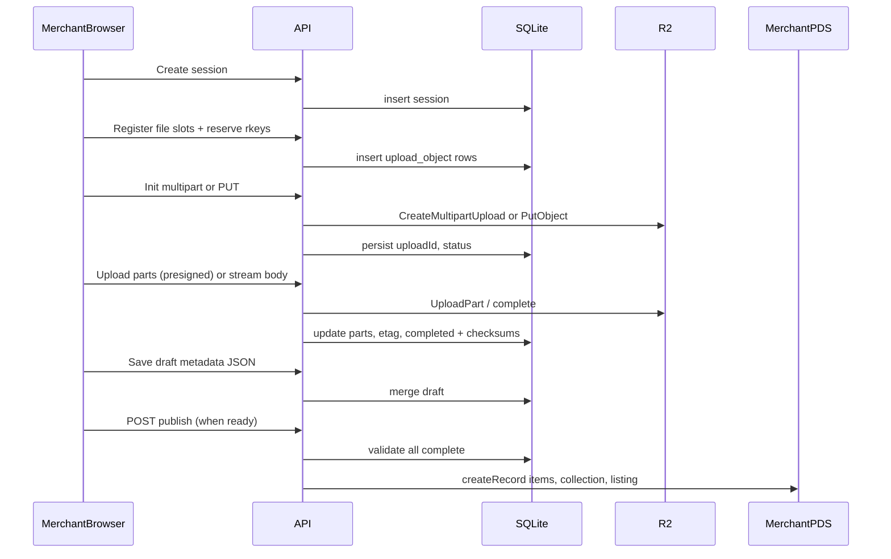

# R2 inventory, resumable uploads, deferred PDS publish, and customer library

## Principles

- **Digital bytes never touch the PDS.** Streams go **only** to Cloudflare R2 ([packages/infra/index.ts](packages/infra/index.ts) `primary` bucket). PDS holds **records** after an explicit **publish** step.
- `**itemClass`** follows [catalog.item.digital.json](packages/shared/src/lexicons/catalog.item.digital.json) `knownValues` only in **metadata**, never in **object keys** or **storage routing.
- **No PDS catalog records until publish:** `catalog.item.digital`, `catalog.collection`, and `catalog.listing` are created **only when** (1) every required R2 object for the draft is **fully uploaded** (checksums/CIDs known server-side) **and** (2) **metadata** required for the chosen flow is **finalized** (license, pricing, titles, collection membership, etc.). Until then, state lives in **local DB** (+ R2 incomplete multipart cleanup policy).

### Expanding paradigm (comment — implement later)

**Leave as-is for the current plan slice**, but design with the expectation that this is an **expanding paradigm**, not a one-off feature:

- **Backwards compatibility:** Keep light **scaffolding** for it—e.g. retain **redirects or aliases** from legacy routes (`/merchant/upload/digital`, existing APIs) and **versionable** draft/session rows (e.g. a `channel` or `inventoryKind` field on sessions, even if only `digital` is implemented first) so older clients and bookmarks do not break while new flows roll out.
- **Digital and physical will both grow:** The same **session + draft + finalize-to-PDS** pattern should generalize to **physical** inventory ([catalog.item.physical](packages/shared/src/lexicons/catalog.item.physical.json), variants, stock) and richer **digital** flows (bundles, multiple assets per SKU) without a second parallel system. SQLite tables and API namespaces should be named **neutrally** (`inventory_*` / `upload_session` with a discriminator) where practical so physical uploads, fulfillment hooks, and non-R2 storage backends can plug in later without renaming everything.

## Current state

- [UploadDigitalPage.tsx](packages/client/src/routes/UploadDigitalPage.tsx) mixes **single-track** and **album/collection** flows, uses PDS `uploadBlob` for files, and writes catalog records **inline** on publish.
- [App.tsx](packages/client/src/App.tsx) exposes `/merchant/upload/digital` only (physical is separate—unchanged).
- [packages/server/src/db/schema.ts](packages/server/src/db/schema.ts): SQLite has `meta`, `merchant_stripe_config`, `payment_fulfillment`—**no** upload-session tables yet.

## Unified merchant route: "upload tracks"

- **Single page** (e.g. `UploadTracksPage.tsx`) at `**/merchant/upload/tracks`, replacing the split between “one track” and “collection” entry points.
- Accept **one or more** files in one session (batch). User can later group them into a **collection** release in the same flow or attach metadata per file—**phase 1** only needs a **functional** multi-file queue + per-file upload state; **fine-grained upload UI** (drag-reorder, rich previews, batch editing) is **out of scope—phase 2**.
- **Redirects:** `/merchant/upload/digital` → `/merchant/upload/tracks` (or keep alias permanently). Update nav links in [MerchantLayout](packages/client/src/routes/MerchantLayout.tsx) / dashboard.

## Server: SQLite model for uploads and drafts

Add tables (names illustrative—implement with Drizzle migrations):

- `**inventory_upload_session` — `id`, `merchantDid` (from OAuth cookie), `status` (`active` | `completed` | `abandoned`), `createdAt`, `updatedAt`. Optional `label` for UX later.
- `**inventory_upload_object`** — one row per logical file being uploaded into a session: `sessionId`, `localSlotId` (client-generated UUID), provisional `**rkey`(TID)** reserved up front for deterministic R2 keys,`fileName`, `contentType`, `byteSize`, `uploadKind` (`single_put`|`multipart`), `**s3UploadId`** + `**status`** (`initiated`|`uploading`|`completed`|`failed`|`aborted`), `r2Key`(full key),`**fileChecksum`**, `**fileCid`**, `durationMs`(nullable),`error`, timestamps. Enables **resume**: client asks server for **which parts are missing** or presigned URLs for remaining parts.
- `**inventory_upload_part` (multipart only) — `objectId`, `partNumber`, `etag`, `size`, unique on `(objectId, partNumber)`.
- `**inventory_publish_draft`** (optional merge into session row) — JSON blob for **metadata not yet on PDS**: per-item titles, `itemClass`, genre, description, **collection structure** (ordered list of `rkey`/slot ids), `defaultLicenseUri` / template choice, listing price/status, **artwork** slot pointing to another `inventory_upload_object` or shared asset row. `**publishedAt`** null until success; store `\*\*pdsItemUris\*\*` / listing uri after publish for idempotency.

**Interrupted session behavior:** On sign-in, merchant can **list active sessions** from DB (filtered by `merchantDid`) and **resume** multipart uploads (list parts, continue). Background task (or on next request) **aborts stale** multipart uploads past TTL (configurable) to avoid orphan R2 state.

## Server: R2 APIs (single + multipart)

- **Small files:** `PutObject` + streaming hash/CID (as in [S3_STRATEGY.md](.alignment/360404-item-uploads/S3_STRATEGY.md)).
- **Multipart (in scope):** `CreateMultipartUpload` → client uploads parts via **presigned `UploadPart`** URLs (or server-proxy parts if you prefer same-origin; presigned is standard) → `CompleteMultipartUpload`. Part size constraints per S3/R2 (e.g. ≥5MB except last part). Threshold: start multipart when `byteSize` ≥ configurable **minPartSize** (e.g. 8–64MB) or always multipart for simplicity in v1—pick one and document.
- After **complete**, server computes **final** `fileChecksum` / `fileCid` (multipart: hash whole object from ETags stream or single GET stream—document choice; many systems hash on the fly during part assembly or re-read once—tradeoff vs R2 egress).
- **Artwork** and **master** are separate `inventory_upload_object` rows (same session), neutral key suffixes (`master`, `artwork` or sanitized basename)—still **no** `itemClass` in key.

## Server: Publish (PDS write) endpoint

- `**POST /api/inventory/publish`** (or similar), cookie-auth, body references `**sessionId\*\` (and draft version).
- Server **validates**: all objects in draft marked `completed`; draft metadata passes minimal invariants; `merchantDid` matches session.
- Then **sequentially** (or transactional best-effort): `createDigitalItem` per track with reserved `**rkey`**; optional `createCollection` referencing those URIs/CIDs; `createListing` as today. Use existing **[atproto proxy](packages/server/src/routes/atproto.ts) patterns. On failure mid-chain, record error on draft and return partial state for retry (idempotent where possible).

## Server: `GET /api/download` (unchanged intent)

- Same as prior plan: buyer cookie, receipt scan, `appSig` verify, collection entitlement, presigned GET for **master** key. Artwork reads via separate presign/media route if needed.

## Client: phase 1 upload UI (minimal)

- **In scope:** file picker / multi-select, list of files with **status** (queued, uploading, complete, error), **resume** after refresh (reload session from API), **discard** session, **metadata + publish** step that calls publish only when server confirms all uploads complete.
- **Out of scope—phase 2:** polished dropzones, batch metadata grid, completeness gamification, advanced track-list builder UX, animations, mobile polish.

## Architecture (staged publish)

## Testing and ops

- Unit tests: key builder, receipt verification, multipart state transitions (mock S3).
- Integration: resume after simulated disconnect; abort stale multipart.
- Env: R2 credentials aligned with Pulumi outputs; document TTL for abandoned uploads.

## Out of scope

- **Phase 2:** Fine upload UI detailing (visual polish, advanced batch editing, marketing copy in wizard).
- Lexicon fields for explicit `r2Key` on records—unless needed; prefer deterministic key from `rkey` + role suffix.

## Optional follow-up

- Server-side sweeper cron for **orphan multipart** cleanup beyond client abort.
- If `artworkCid` must remain strictly decodable as PDS blob for third parties, reconcile; target remains R2 bytes + CID metadata on record.
