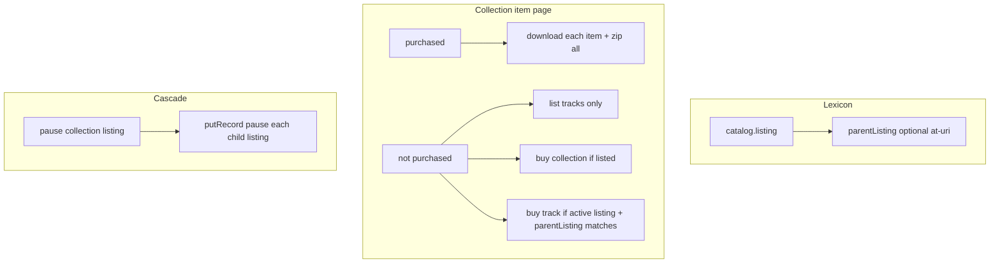

# Remove `essential`; add `parentListing`; collection item page + downloads

## A. `essential` removal (unchanged core)

- **Lexicon:** Remove `items[].essential` from [catalog.collection.json](packages/shared/src/lexicons/catalog.collection.json).
- **Entitlement:** Collection receipt → any `collection.items[].uri` may be downloaded individually ([download.ts](packages/server/src/routes/download.ts)); **ignore** legacy `essential` if present.
- **Publish:** Drop `essential` from [inventory.ts](packages/server/src/routes/inventory.ts) slots and emitted records.
- **Types:** Update [lexicons.ts](packages/client/src/types/lexicons.ts) `CollectionItemEntry`; tolerate unknown JSON fields everywhere records are parsed.
- **Upload:** Replace UI with **Allow individual purchase** (intent for listings only; see prefill log).

## B. Collection **item page** (public `/item/...` — [ItemDetailPage.tsx](packages/client/src/routes/ItemDetailPage.tsx))

Assume the page resolves a **collection** catalog record and loads the artist’s **listing rows** (today: single listing for the page item; extend to discover **per-track listings** for members).

### When the viewer **has purchased the collection**

(receipt where `item` is the **collection** and buyer is session user — same entitlement signal as download API.)

- **Per-item download:** Every entry in `collection.items` (all **roles**: track, document, artwork, etc.) gets an individual download control (not only `role === "track"` — extend beyond [TrackList.tsx](packages/client/src/components/public/TrackList.tsx) which currently filters tracks only).
- **Whole collection:** One **Download collection** (or “Download all”) action that fetches a **single archive** of all member files (new server capability; see below).

### When the collection **has not** been purchased

- **Listing:** Show **all tracks** (`role === "track"`) in the tracklist (current [TrackList](packages/client/src/components/public/TrackList.tsx) behavior).
- **Purchasable:**
  - The **collection** itself **if** it has an **active** listing for the collection item URI.
  - A **track** only **if** that digital item has an **active** listing whose `**parentListing` equals this collection’s listing AT-URI (so unrelated singles for the same file on another release do not show as buyable here). If you ever need “any active listing for this track URI,” that can be a deliberate loosening later.

Tracks without such a child listing appear in the list but **without** a buy path (or disabled “not for sale” state).

## C. Lexicon: `parentListing` on `catalog.listing`

**File:** [catalog.listing.json](packages/shared/src/lexicons/catalog.listing.json)

Add optional property:

- `**parentListing`:** `string`, format `at-uri`, description: AT-URI of another `catalog.listing` record (the **collection listing**) when this listing sells a **member digital item as an individual single. Absent for standalone singles and for the collection listing itself.

**Purpose:**

1. **Storefront:** On the collection item page, resolve which tracks are individually purchasable by finding listings whose `item.uri` is the track’s digital URI and whose `parentListing` matches this collection’s listing URI (avoids guessing from price/title alone).
2. **Cascade pause:** When the merchant **pauses** (or otherwise stops sale on) the **collection listing**, the client (or server, if you add an admin API) **updates each child listing** with `parentListing === collectionListingUri` to `status: "paused"` so records stay truthful and webhooks/checkout stay consistent.

**Checkout / Stripe:** [fulfillCheckoutSession.ts](packages/server/src/lib/stripe/fulfillCheckoutSession.ts) (and any other path that validates a listing before payment) must treat a listing as **not purchasable** if it has `parentListing` and the **resolved parent** listing is not in an **active** (sale-allowed) state — even if the child row still says `active`. That keeps behavior correct if cascade lag or manual edits occur.

**Creating listings:** [ListingsPage.tsx](packages/client/src/routes/ListingsPage.tsx) (and upload-driven bulk flow): when creating a listing for a **track** that belongs to a published collection, set `parentListing` to the **at-uri of the collection’s listing** (merchant must have created the collection listing first, or flow creates collection listing then children).

## D. Whole-collection download (server)

Today [download.ts](packages/server/src/routes/download.ts) only signs **one** object per digital item R2 key. Add an endpoint (e.g. `GET /api/download/collection-zip?collectionUri=...`) that:

- Verifies the session holds a **valid collection receipt** (same buyer + signature rules as single-item download).
- Enumerates **all** `collection.items` URIs, resolves each to digital inventory keys, builds **one zip** (streaming or temp-assemble), returns signed URL or streams response.

Client: ItemDetailPage (and optionally [PurchaseDetailPage.tsx](packages/client/src/routes/PurchaseDetailPage.tsx)) calls it for the **Download collection** button.

## E. SQLite prefill log (unchanged intent)

Append-only log on successful inventory publish; authenticated **GET latest** for merchant DID; powers upload → listings shortcut and “latest collection” quick listing without encoding prefill in lexicon. Payload can include `**collectionListingUri`** once created and `**individualPurchaseTrackUris\*\`to drive multi-row listing creation with`parentListing` filled in.

## F. Purchase detail page

Align with §B for consistency: if the receipt is for a collection, show **all items** for download + **collection zip**; remove any `essential` filter ([PurchaseDetailPage.tsx](packages/client/src/routes/PurchaseDetailPage.tsx)).

## Resolved vs open

- **Resolved:** Item page when not purchased lists **tracks only**; purchase affordances only for collection + tracks with **active** listings.
- **Resolved:** `parentListing` is the lexicon-native link for child track listings + cascade pause + checkout parent guard.
- **Open (implementation choice):** Zip implementation detail (on-the-fly vs worker, size limits). Optional: server-side cascade endpoint vs client-only batch `putRecord` when pausing collection listing.

