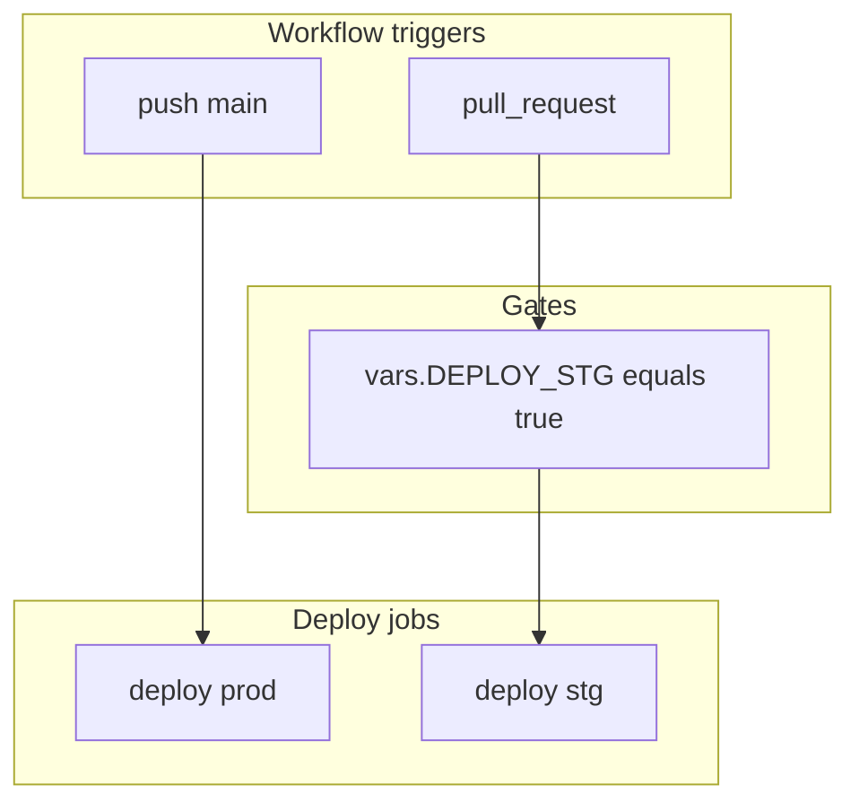

# Staging environment and environment variables (revised)

## Goals

1. **Production:** automated deploy on every **push to `main`** (keep current behavior, parameterized as the prod path).
2. **Staging:** automated deploy on **pull request** activity for PR branches — use `pull_request` with `types: [opened, synchronize, reopened]` so each push to the PR head branch runs a staging deploy (shared staging app; latest PR build wins).
3. **Optional staging:** staging deploy jobs run **only** when the GitHub repository **variable** `DEPLOY_STG` is set to `true` (string compare in workflow `if:`). If unset or not `true`, PR workflows should skip deploy (and skip staging preflight) so forks/repos without staging infra pay no cost and do not fail on missing stg secrets.
4. **Documentation:** update `**[.env.example](.env.example)`**, `**[packages/server/.env.example](packages/server/.env.example)`**, and `**[packages/client/.env.example](packages/client/.env.example)**` so naming is explicit: **local** vars (app runtime), **Fly** runtime secrets (server-only, set via CLI), and **CI controls (`DEPLOY_STG`is not read by the app — it is a GitHub Actions repository variable; document it in`.env.example` as the convention for “where this knob lives”).

## What you have today (unchanged facts)

- `**[.github/workflows/deploy.yml](.github/workflows/deploy.yml)` — `pulumi up` with `PULUMI_STACK` (default `prod`), then `flyctl deploy` with `VITE\__` from secrets.
- `**[packages/infra/index.ts](packages/infra/index.ts)` — buckets per stack: `bazaar-${stack}`, `bazaar-pulumi-state-${stack}`.
- `**[fly.toml](fly.toml)` — single prod Fly app; server secrets set on Fly, not in the workflow.

## CI design

### Triggers (`deploy.yml`)

- `**on`: include both:
  - `push: branches: [main]`
  - `pull_request: types: [opened, synchronize, reopened]` (optionally restrict `branches:` for the base, e.g. only PRs into `main`, if desired)
- **Job: `deploy-production`**
  - `if: github.event_name == 'push' && github.ref == 'refs/heads/main'`
  - `PULUMI_STACK: prod`, Fly prod config/app, secrets from `**environment: production**` (recommended) or existing repo secrets if you defer environments.
- **Job: `deploy-staging`**
  - `if: github.event_name == 'pull_request' && vars.DEPLOY_STG == 'true' && github.event.pull_request.head.repo.full_name == github.repository`
  - The last clause avoids running deploy (and exposing secrets) for **fork** PRs unless you explicitly choose a different policy later.
  - `PULUMI_STACK: stg`, `fly deploy` with `fly.stg.toml` / staging app name.
  - Secrets: `**environment: staging` (recommended duplicate secret names) or `STG_`-prefixed repository secrets — pick one convention and document it in `.env.example`.

### Preflight (`[deploy-preflight.yml](.github/workflows/deploy-preflight.yml)`)

- Same `on` triggers as deploy (or a superset).
- **Prod preflight:** run on `push` to `main` (verify prod-required secrets).
- **Staging preflight:** run only when `github.event_name == 'pull_request' && vars.DEPLOY_STG == 'true' && same-repo check` (verify staging-required secrets). When `DEPLOY_STG` is not `true`, do not fail the PR for missing staging secrets.

### `DEPLOY_STG` (repository variable)

- Set under **GitHub → Settings → Secrets and variables → Actions → Variables** as `DEPLOY_STG=true`.
- Not loaded by Bun/Vite; **document** in repo `.env.example` files under a **“CI / GitHub Actions”** section so contributors know the knob exists and how it is spelled.

## Infra and Fly (unchanged from prior plan)

1. Pulumi stack `**stg` → R2 buckets `bazaar-stg` (and state bucket per stack).
2. Second Fly app + `**fly.stg.toml` + separate volume; `fly secrets set` on the staging app for server-only vars (see `[packages/server/.env.example](packages/server/.env.example)`).

## `.env.example` updates (naming conventions)

Implement a consistent **three-layer** story in examples:

| Layer              | Where documented                                                                 | Purpose                                                                                                                                                                                                 |
| ------------------ | -------------------------------------------------------------------------------- | ------------------------------------------------------------------------------------------------------------------------------------------------------------------------------------------------------- |
| **Local app**      | `packages/server/.env.example`, `packages/client/.env.example`                   | Names and semantics for `npm run dev`; no staging toggle here unless the app reads one (it does not for `DEPLOY_STG`).                                                                                  |
| **CI**             | Root `[.env.example](.env.example)` (and one-line pointer from package examples) | `DEPLOY_STG` — GitHub **repository variable**; optional short list of related vars (`PULUMI_STACK` is job-set, not local). Clarify these are **not** copied into `packages/server/.env` for local runs. |
| **Hosted runtime** | All three files                                                                  | Brief note: production/staging **server** secrets are set with `fly secrets set` on the respective Fly app; align with same variable names as in `packages/server/.env.example`.                        |

**Concrete edits**

- `**[.env.example](.env.example)`:* Add section *GitHub Actions (repository Variables, not process env) with `DEPLOY_STG=true` to enable PR → staging deploys; cross-link to `packages/server/.env.example` / `packages/client/.env.example` for local dev; keep R2/Pulumi hints aligned with existing style.
- `**[packages/server/.env.example](packages/server/.env.example)`:* Add a short *Deployment* subsection: Fly holds runtime secrets per app; CI passes `VITE\_*`at image build for the client; reference`DEPLOY_STG` in GitHub for staging automation.
- `**[packages/client/.env.example](packages/client/.env.example)`: Same pointer for CI/Fly so client env docs stay consistent.

Use the exact name `**DEPLOY_STG` everywhere (no alternate spellings) so it matches `vars.DEPLOY_STG` in workflows.

## Files to touch when implementing

- `**[.github/workflows/deploy.yml](.github/workflows/deploy.yml)` — split jobs, conditions, `environment:` for staging vs production, `PULUMI_STACK`, Fly `--config` / app for stg.
- `**[.github/workflows/deploy-preflight.yml](.github/workflows/deploy-preflight.yml)` — conditional jobs matching the above.
- `**fly.stg.toml` (new) next to `[fly.toml](fly.toml)`.
- `**[.env.example](.env.example)`**, `**[packages/server/.env.example](packages/server/.env.example)`**, `\*\*[packages/client/.env.example](packages/client/.env.example)\*\*`— naming conventions and`DEPLOY_STG` documentation.

Optional: populate `**[.alignment/260405-stg-env/PLAN.md](.alignment/260405-stg-env/PLAN.md)**` with a short pointer to this plan for repo-local tracking.

## Security note

Fork PRs: the `head.repo.full_name == github.repository` guard is recommended so arbitrary forks cannot trigger workflows that use your Fly/Pulumi secrets. If you later want “trusted fork” behavior, that needs an explicit maintainers-only policy and separate design.
